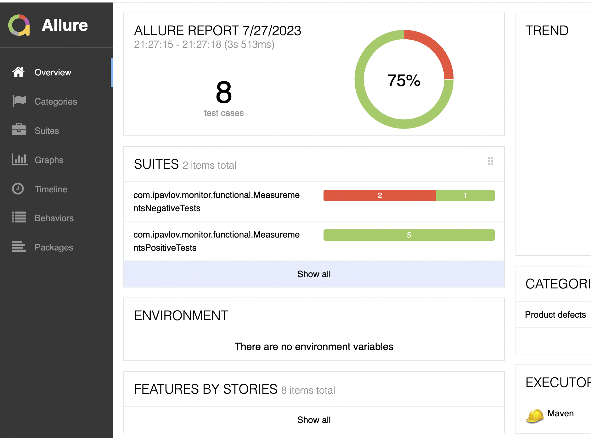
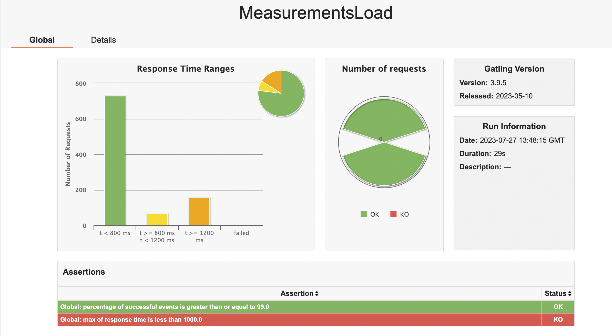
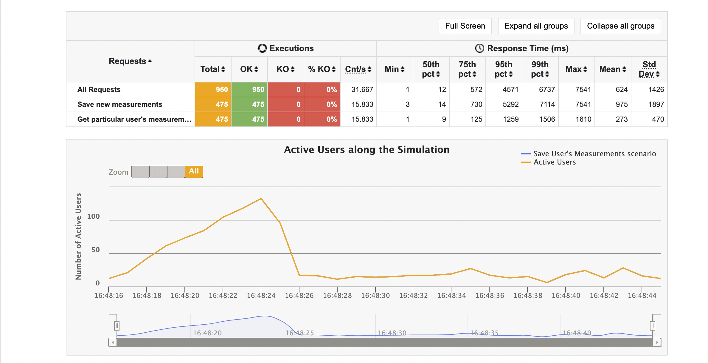
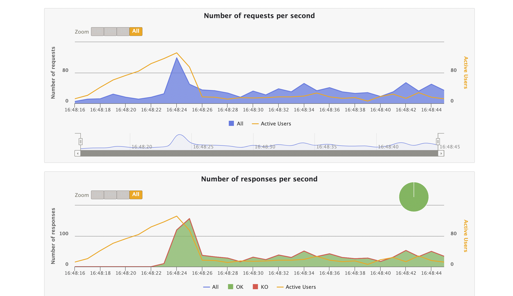

# Utilities-monitor

Performance and Functional testing for https://github.com/singeev/utilitiesMonitor project.

Before running the tests, launch the Application - utilitiesMonitor according to the instructions in the project description

- Stack: Java 17, RestAssured, JUnit5, Maven, Gatling
- Reporting: Allure Reports, Gatling Reports

## USAGE examples

## if Functional Tests: 

```bash
mvn clean -Dtest=*/functional/* test
```

## Reports: 

```bash
mvn allure:report
mvn allure:serve
```

## if Performance Tests:

```bash
mvn gatling:test
```

## Allure Reports
> Dashboard with statuses of testcases on Allure
<p  align="left">
<code>

</code>
</p>

## Gatling Report
> Dashboard of load testing results
<p  align="left">
<code>

</code>
</p>

> Activite users graph
<p  align="left">
<code>

</code>
</p>

> Number of request and response per seconds
<p  align="left">
<code>

</code>
</p>
